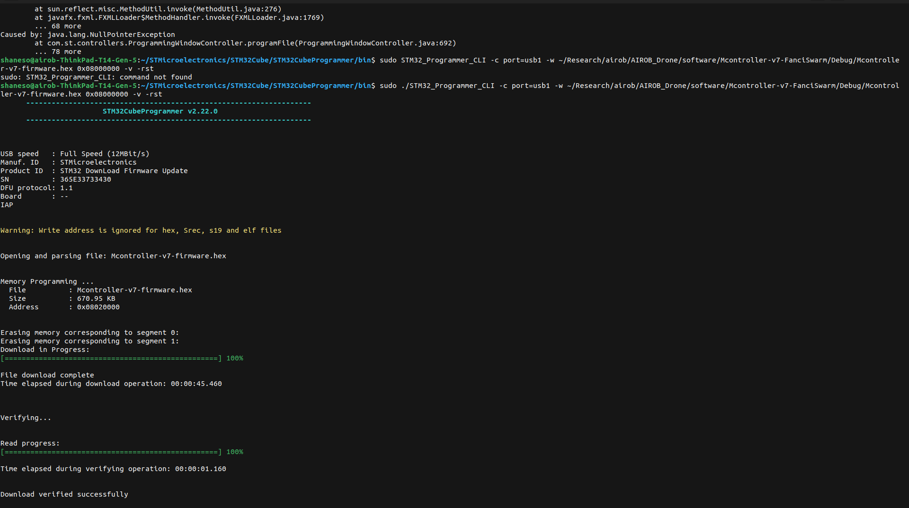

# Mcontroller-v7 Firmware Compiling Documentation

### Prerequisites

For the firmware compile build to be successful, the Mcontroller-v7-firmware submodule must have the FanciSwarmTM dependency pack, i.e. `libMcontroller-v7-FanciSwarm.a`. In addition to the main repository, the dependency pack and the `libMcontroller-v7-firmware.a` must both be included. STM32CubeIDE is recommended for compiling the Mcontroller-v7-firmware source code, and STM32CubeProgrammer is recommended for flashing and uploading the modified firmware onto the FanciSwarm drone.

### Compiling

In STM32CubeIDE, run the `Debug` build process to compile the firmware. This may need to be done twice, if the first time produces linking errors. The second time should log something like `x:x:x Build Finished. 0 errors, 0 warnings. (took x ms)`. Note that building the firmware using the `Release` process will not work. Only the `Debug` build is to be used for the `Mcontroller-v7-firmware` project.

### Uploading the Firmware

Check which port the drone is connected to, e.g. `port=usb1`, since it will be used to identify which port is to be used to upload the modified firmware.

In the STM32CubeProgrammer software (recommended to use the CLI terminal to avoid versioning issues and runtime exceptions). When in the programmer CLI, run the following command script:

```
sudo ./STM32_Programmer_CLI -c port=<PORT_ID> -w ~/Research/airob/AIROB_Drone/software/Mcontroller-v7-FanciSwarm/Debug/Mcontroller-v7-firmware.hex 0x08000000 -v -rst
```

where the flag `<PORT_ID>` may be modified with your verified port name. When the process is complete, the upload log will look like:



Note that, when using the STM32CubeProgrammer interface, the version may need to be changed to an older one for the upload to work. This is because of potential runtime exceptions and environment issues.

### Configure Firmware for Motion Capture (Vicon)

In a preferred IDE or text editor, find the `config.h` file in the `Clibrary/include/` directory. Modify the following preprocessor directives to change the settings:

```
#define USE_MAG 1
```

```
#define USE_ODOMETRY 1
```

```
#define USE_MOTION 1
```

Once the directives are set, test it with the firmware by compiling it, then uploading it to the FanciSwarm drone processor. If odometry and motion capture work, change the SLAM Z directive setting:

```
#define USE_ODOM_Z 1
```

